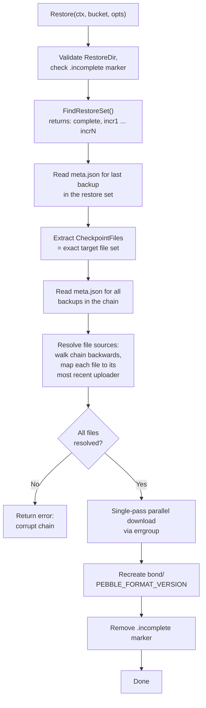

# Enhancement Proposal: Optimized Backup Restore

## 1. Problem Statement

The current `Restore()` implementation in `backup/restore.go` downloads **every file from every backup** in the restore chain. Backups are applied sequentially -- the complete backup first, then each incremental in datetime order. Within each stage, files are downloaded in parallel. However, later incrementals frequently **overwrite** files that were already downloaded from an earlier backup, making those earlier downloads redundant.

Files that are always re-uploaded in every incremental backup:

- `MANIFEST-*` (changes on every compaction/flush)
- `CURRENT` (points to the active manifest)
- `OPTIONS-*` (Pebble options snapshot)
- WAL files (if present in the checkpoint)

These metadata files are small, but the pattern extends to any SST file that appears in multiple backups when a chain grows long. More importantly, the **sequential outer loop** prevents full download parallelism -- files from incremental N+1 cannot begin downloading until incremental N is fully applied.

### Concrete Example

Consider a backup chain with 1 complete + 5 incrementals:

| Backup | Type | Files Uploaded | Total Files in Checkpoint |
|--------|------|---------------|--------------------------|
| T1 | complete | 50 | 50 |
| T2 | incremental | 8 | 52 |
| T3 | incremental | 6 | 54 |
| T4 | incremental | 7 | 55 |
| T5 | incremental | 5 | 53 |
| T6 | incremental | 6 | 52 |

**Current restore**: downloads 50 + 8 + 6 + 7 + 5 + 6 = **82 files**, of which many are redundant overwrites of MANIFEST, CURRENT, and OPTIONS from earlier stages. The sequential loop also forces 6 serial download phases.

**Optimized restore**: the final checkpoint has **52 unique files**. Each file is downloaded exactly once from the backup that last uploaded it, in a **single parallel download phase**. That is **30 fewer downloads** and no sequential bottleneck.

---

## 2. Key Insight

Every backup's `meta.json` already stores two file lists:

- **`Files`** -- the files uploaded in that particular backup (used during download).
- **`CheckpointFiles`** -- ALL files that constitute a complete database at that point in time (used by the next incremental to compute its diff).

The **last backup** in the restore set has a `CheckpointFiles` list that is the **exact, complete set of files** needed to reconstruct the database. We do not need to replay the chain; we only need to locate where each of those files was uploaded and download it from there.

---

## 3. Proposed Algorithm

The optimized restore operates in four phases:

### Phase 1: Determine the Restore Set

Use the existing `FindRestoreSet(ctx, bucket, prefix, before)` function unchanged. It returns `[complete, incr1, incr2, ..., incrN]` sorted by datetime ascending.

### Phase 2: Read the Target File Set

Read `meta.json` for the **last** backup in the restore set. Its `CheckpointFiles` field is the definitive list of files the restored database must contain.

```go
targetMeta := readMeta(ctx, bucket, restoreSet[len(restoreSet)-1].Prefix, ...)
requiredFiles := targetMeta.CheckpointFiles  // the exact file set to restore
```

### Phase 3: Resolve File Sources (Backward Walk)

For each file in `requiredFiles`, determine which backup in the chain uploaded it. Walk the restore set **backwards** (newest to oldest), reading each backup's `Files` list. The first backup (from the end) whose `Files` contains a given filename is the authoritative source for that file.

```go
type fileSource struct {
    File         FileInfo  // name + size
    BackupPrefix string    // object storage prefix of the source backup
}

// Build the resolution map.
needed := make(map[string]bool, len(requiredFiles))
for _, f := range requiredFiles {
    needed[f.Name] = true
}

var resolved []fileSource

// Walk backwards: newest incremental -> ... -> complete.
for i := len(allBackups) - 1; i >= 0 && len(needed) > 0; i-- {
    for _, f := range allBackups[i].meta.Files {
        if needed[f.Name] {
            resolved = append(resolved, fileSource{
                File:         f,
                BackupPrefix: allBackups[i].prefix,
            })
            delete(needed, f.Name)
        }
    }
}
```

After this loop, `resolved` contains exactly one entry per required file, pointing to the most recent backup that uploaded it. If `len(needed) > 0` after the loop, the chain is corrupt (a file in `CheckpointFiles` was never uploaded by any backup in the chain) -- this should be reported as an error.

### Phase 4: Single-Pass Parallel Download

Download all resolved files in a **single parallel phase** using `errgroup` with the configured concurrency. No sequential stages, no overwrites.

```go
g, gctx := errgroup.WithContext(ctx)
g.SetLimit(concurrency)

for _, src := range resolved {
    g.Go(func() error {
        objName := path.Join(src.BackupPrefix, src.File.Name)
        localPath := filepath.Join(opts.RestoreDir, src.File.Name)
        return downloadFileWithRetry(gctx, bucket, objName, localPath, ...)
    })
}

if err := g.Wait(); err != nil {
    return err
}
```

---

## 4. Data Flow



---

## 5. Comparison: Current vs. Optimized

| Aspect | Current Restore | Optimized Restore |
|--------|----------------|-------------------|
| Download phases | N (one per backup in chain) | 1 (single parallel pass) |
| Files downloaded | Sum of all `meta.Files` across chain | Exactly `len(CheckpointFiles)` of last backup |
| Overwrites | Yes (MANIFEST, CURRENT, OPTIONS, etc.) | None |
| Sequential bottleneck | Yes (outer loop is serial) | No |
| Meta reads required | N (all backups) | N (all backups, same as current) |
| Correctness guarantee | Replay ordering ensures consistency | `CheckpointFiles` is the authoritative state |

### Savings Formula

Given a restore set with backups `B_0` (complete), `B_1` ... `B_N` (incrementals):

```
Current downloads  = sum(|B_i.Files|, i=0..N)
Optimized downloads = |B_N.CheckpointFiles|

Savings = Current downloads - Optimized downloads
        = sum of all redundant/overwritten file downloads
```

The savings grow with the number of incrementals and the number of metadata files (MANIFEST, CURRENT, OPTIONS, WAL) that get re-uploaded in each incremental. For a typical chain of 10 incrementals with 4 metadata files each, that is at least 36 redundant downloads avoided (9 incrementals x 4 files that were already downloaded in the complete or an earlier incremental).

---

## 6. API Impact

### No Breaking Changes

The optimization is internal to the `Restore()` function. The existing `RestoreOptions` struct, `FindRestoreSet()`, `BackupMeta`, and all public APIs remain unchanged.

### Optional: New `RestoreOptions` Field

If a gradual rollout is desired, a boolean field can gate the optimization:

```go
type RestoreOptions struct {
    // ... existing fields ...

    // Optimized enables single-pass restore that downloads each file exactly
    // once from its most recent source backup. When false (default), the
    // legacy sequential restore is used.
    Optimized bool
}
```

Once validated, the optimized path can become the default and the field can be removed.

### Progress Reporting

Progress reporting changes slightly: instead of reporting `totalFiles` as the sum of all `meta.Files` across the chain, it reports the deduplicated count (`len(CheckpointFiles)`). This means the total is smaller but more accurate -- it reflects the actual work being done.

---

## 7. Implementation Outline

Changes are confined to `backup/restore.go`. No changes to backup, listing, deletion, or CLI code.

### New Internal Helper

```go
// resolveFileSources maps each required file to the backup that should supply it.
// It walks the backup chain backwards so that newer versions of a file take priority.
func resolveFileSources(
    requiredFiles []FileInfo,
    backups []backupWithMeta,
) ([]fileSource, error)
```

### Modified `Restore()` Flow

1. Steps 1-7 unchanged (validation, incomplete check, FindRestoreSet, create dir, write marker, resolve retry params).
2. **Replace** the current "pre-read all metas + sequential download loop" with:
   a. Pre-read all metas (same as current).
   b. Extract `CheckpointFiles` from the last backup's meta.
   c. Call `resolveFileSources()` to build the download plan.
   d. Compute `totalFiles` and `totalBytes` from the resolved set (not from sum of all `meta.Files`).
   e. Pre-create subdirectories from the resolved set.
   f. Execute a single parallel download phase.
3. Bond metadata recreation and `.incomplete` marker removal unchanged.

---

## 8. Edge Cases

### Single Complete Backup (No Incrementals)

The restore set contains only one backup. `CheckpointFiles == Files`. The optimized path resolves every file to the complete backup. Behavior is identical to current restore but uses a single download phase (already the case for one backup).

### Point-in-Time Restore (`Before` Cutoff)

`FindRestoreSet()` already handles the `Before` cutoff by returning only backups at or before the timestamp. The optimized restore uses the `CheckpointFiles` from the **last backup in the filtered set**, which is correct -- it represents the database state at that point in time.

### Empty Incremental

An incremental backup where no files changed (only metadata files like MANIFEST/CURRENT are uploaded) has `Files` containing only those metadata files. The backward walk still resolves SST files from earlier backups. Works correctly.

### Corrupt Chain (Missing File)

If a file listed in the last backup's `CheckpointFiles` is not found in any backup's `Files` within the chain, the restore should return an error:

```go
if len(needed) > 0 {
    missing := make([]string, 0, len(needed))
    for name := range needed {
        missing = append(missing, name)
    }
    return fmt.Errorf("corrupt backup chain: %d files in CheckpointFiles not found in any backup: %v", len(missing), missing)
}
```

### Deleted SST Files (Compaction)

Pebble compaction may remove SST files between checkpoints. A file present in an older checkpoint but absent from the target checkpoint is simply not in `CheckpointFiles` and will not be downloaded. This is correct -- leftover SSTs are harmless but the optimized restore avoids downloading them entirely.

### Interrupted Restore Recovery

The `.incomplete` marker mechanism is unchanged. If the restore is interrupted, the marker remains. On retry, the directory is cleaned and the optimized restore runs from scratch. Since there is only one download phase (no sequential overwrite dependency), partial files from an interrupted download do not affect correctness.

---

## 9. Testing Strategy

### New Unit Tests

| Test | What it verifies |
|------|-----------------|
| `TestOptimizedRestore_MatchesLegacy` | Restore via optimized path produces identical database content as legacy restore for a chain of complete + N incrementals. |
| `TestOptimizedRestore_NoRedundantDownloads` | Using a counting bucket wrapper, verify that each file is downloaded exactly once and `total downloads == len(CheckpointFiles)`. |
| `TestOptimizedRestore_SingleComplete` | Optimized restore with only a complete backup (no incrementals) works correctly. |
| `TestOptimizedRestore_PointInTime` | Optimized restore with `Before` cutoff restores the correct subset of data. |
| `TestOptimizedRestore_CorruptChain` | Returns an error when `CheckpointFiles` references a file not found in any backup's `Files`. |
| `TestResolveFileSources_BackwardPriority` | Files appearing in multiple backups are resolved to the most recent one. |
| `TestResolveFileSources_AllFromComplete` | When no incrementals exist, all files resolve to the complete backup. |
| `TestOptimizedRestore_Progress` | Progress events report the deduplicated file count and byte total. |
| `TestOptimizedRestore_InterruptAndRetry` | Interrupted optimized restore leaves `.incomplete` marker; retry succeeds. |

### Existing Tests

All existing restore tests should continue to pass unchanged, serving as regression coverage.
